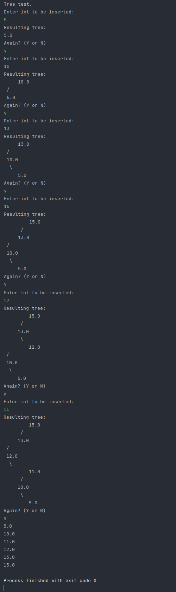

# Food Delivery App

This app was made for a class at PSU. It simulates a food delivery app, such as UberEats. I wrote my own implementations for linked lists, doubly linked lists, binary trees, and balanced trees. Two test files are used to read in information to show basic functionality. However, in main, calculating driver proximities is not currently functional, but creating a balanced tree with integers works to show functioning balanced tree.

